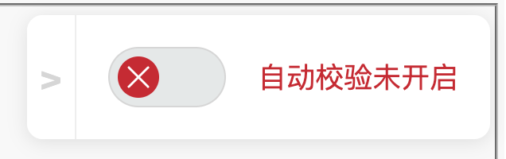
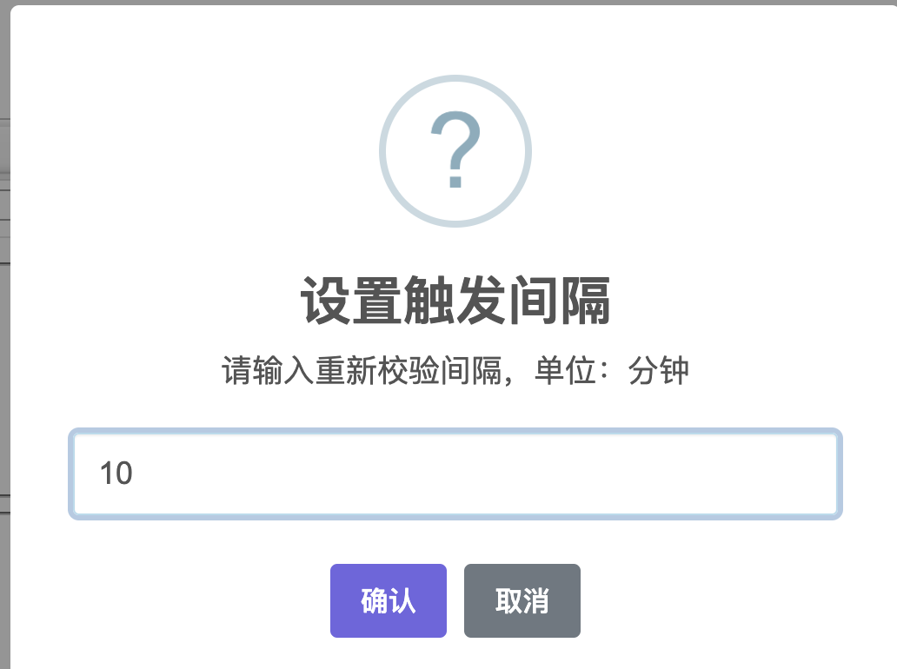
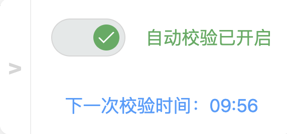

# qbittorrent-autorecheck

## 使用场景

在使用 `qbittorrent` 进行辅种时，经常会出现几个不同 tracker 但是是相同种子同时下载的情况，为了防止下载进度差距太大，需要定时让它们重新进行校验，于是我写了这个油猴脚本来解放双手。

## 使用前提

1. qbittorrent 需要开启 web UI

2. 浏览器需要安装油猴插件

    > 本人不是前端大佬，不懂什么浏览器兼容，所以最好在  Chromium 内核的浏览器中使用该脚本

## 使用方法

1. 在油猴中创建一个新的脚本

2. 复制本仓库中 `auto-recheck.js` 文件的全部代码，粘贴到脚本内

3. 修改最前面注释中的 `@match` 参数为自己的 web UI 前缀，确保脚本能够生效

4. 保存，刷新 web UI 界面，此时脚本就会出现在屏幕右侧的中间位置

5. 点击自动校验按钮，输入一个校验间隔，点确定就可以了

## 脚本做了些什么

先是倒计时，倒计时结束之后会在 **当前界面** 中选取状态为 `下载` 或者是 `[F] 下载` 的任务进行重新校验，等待校验完成之后，重新开始倒计时。如果页面中找不到这个状态的任务，脚本停止。

## 界面展示







## 其他

如果觉得界面太花里胡哨了，也可以通过浏览器标签注入脚本，脚本的日志会打印在控制台中。默认计时时间是 10 分钟，可以在脚本的末尾进行修改。

### 使用方法

1. 在浏览器里面创建一个新的标签，名字随便

2. 在 url 属性中粘贴下面这段代码

```javascript
javascript:(function f(timeout){!timeout&&(timeout=5);var recheckBtn=document.querySelector("a[href='#forceRecheck']");if(!recheckBtn){console.log("获取不到重新校验按钮，1s 后重试");setTimeout(f.apply(this,timeout),1000);return}console.log("成功获取到重新校验按钮，开始计时 "+timeout+" 分钟");var getTaskItems=function(){var items=document.getElementsByClassName("torrentsTableContextMenuTarget")||[];if(!items||items.length===0){return[]}var res=[];for(var i=0;i<items.length;i++){var tds=items[i].getElementsByTagName("td");var flag=false;for(var j=0;j<tds.length;j++){if(tds[j].innerHTML.indexOf("下载")!==-1){flag=true}}flag&&res.push(items[i])}return res};var checkReCheckFinish=function(){var items=document.getElementsByClassName("torrentsTableContextMenuTarget")||[];for(var i=0;i<items.length;i++){var tds=items[i].getElementsByTagName("td");for(var j=0;j<tds.length;j++){if(tds[j].innerHTML.indexOf("校验")!==-1){setTimeout(checkReCheckFinish,1000);return}}}console.log("所有任务校验完成，重新开始计时 "+timeout+" 分钟");console.log("下一次校验开始时间：",new Date((new Date().getTime()+timeout*60*1000)));setTimeout(startReCheck,timeout*60*1000)};var startReCheck=function(){console.log("正在获取任务列表...");var items=getTaskItems();if(items.length===0){console.log("任务列表为空或所有任务都以下载完成，定时器关闭");return}console.log("成功获取到任务列表",items);for(var i=0;i<items.length;i++){items[i].click();recheckBtn.click()}items[items.length-1].classList.remove("selected");console.log("所有下载任务重新开始校验...");setTimeout(checkReCheckFinish,5000)};setTimeout(startReCheck,timeout*60*1000)})(10);
```

3. 保存标签，进入 web UI，点击设置好的标签就开启自动校验了
